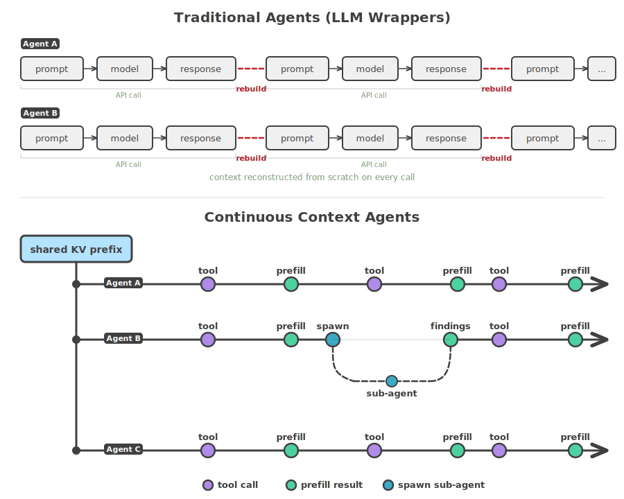
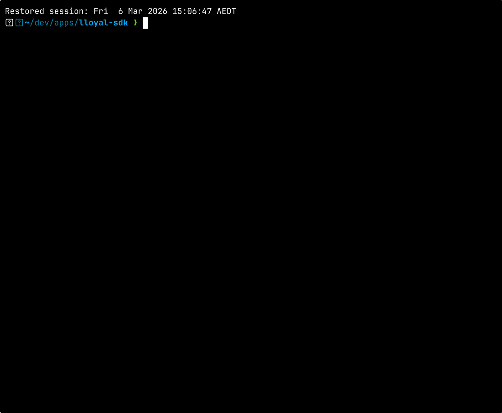

# lloyal-agents

[](https://github.com/lloyal-ai/sdk/actions/workflows/ci.yml)
[](https://github.com/lloyal-ai/lloyal.node/actions/workflows/gpu-test.yml)
[](https://www.npmjs.com/package/@lloyal-labs/lloyal-agents)
[](https://www.npmjs.com/package/@lloyal-labs/sdk)
[](LICENSE)

**[Continuous Context](https://lloyal.ai/blog/continuous-context) agent runtime for multi-agent inference.**

Agents are branches of a single inference process — forked from shared KV cache state, prefilling tool results into the attention mechanism, spawning sub-agents from live branches. Context is never serialized, summarized, or reconstructed.

<picture>
  <source media="(prefers-color-scheme: dark)" srcset="assets/continuous-context-dark.svg">
  
</picture>

<p>
  
  <br>
  <em>Qwen3 4B + 0.6B reranker · 3 agents · 14 tool calls · 98s · fully offline on M2 MacBook Pro</em>
</p>

* **Parallel agents, one GPU** — N branches advance in a single forward pass
* **Recursive sub-agents** — agents spawn agents from live state, not summaries
* **Shared KV prefix** — tokenize once, every agent inherits it
* **Multi-hop tool use** — results land fully before the next action
* **Tools that spawn agents** — the model decides when to go deeper
* **Branch comparison** — N attempts from one origin, measure agreement
* **Fully offline** — no API key, no network

## Install

```bash
npm i @lloyal-labs/lloyal-agents
```

**Backends:** [lloyal.node](https://github.com/lloyal-ai/lloyal.node) — prebuilt binaries for macOS, Linux, and Windows with CPU/GPU support.

## Use this if

* You want **local tool-calling agents**
* You need **parallel or recursive task execution**
* You want **shared-state efficiency** instead of many isolated model calls
* You care about **inspectable execution** and real runtime control

## Don't use this if

* You just need a chat wrapper
* You only use hosted APIs
* You do not need sub-agents, branching, or runtime-level control

## Quickstart

```typescript
import { main, call } from "effection";
import { createContext } from "@lloyal-labs/lloyal.node";
import { initAgents, generate } from "@lloyal-labs/lloyal-agents";

main(function* () {
  const ctx = yield* call(() =>
    createContext({
      modelPath: "model.gguf",
      nCtx: 16384,
      nSeqMax: 8,
      typeK: "q4_0",
      typeV: "q4_0",
    }),
  );

  const { session } = yield* initAgents(ctx);

  const result = yield* generate({
    parent: session.trunk,
    prompt: "In one sentence, explain KV cache sharing.",
  });

  console.log(result.text);
});
```

The basic mental model is simple:

* create a backend context
* initialize the runtime
* generate from a branch

From there, you can fork branches, run agents in parallel, attach tools, and promote winning branches into the session trunk.

## Why it's different

Most agent frameworks orchestrate **around** a model — prompt, read response, call a tool, prompt again. Each agent is a separate API call with its own context window.

`lloyal-agents` orchestrates **inside** the running inference process. Agents are branches of one live model runtime. They share KV cache state up to a fork point, advance together through batched decode steps, and consume tool results by prefilling tokens directly into their own branches.

When an agent calls a tool, the result is fully prefilled into its KV cache before it generates another token. The model sees the complete result and makes a clean decision — call another tool, refine the query, or report. This produces multi-hop reasoning: later tool calls reference discoveries from earlier ones, because the full chain is physically present in the branch's attention state.

When an agent needs to go deeper, it calls a tool that spawns sub-agents. The sub-agents fork from a shared root within the same inference process — same GPU, same KV cache, same event stream. The calling agent's branch stays alive; when the sub-agents report back, their findings return as a tool result into the caller's live context.

## What ships

### `@lloyal-labs/lloyal-agents`

The high-level runtime for recursive agents, tools, and orchestration.

Includes:

* `initAgents`
* `generate`
* `diverge`
* `useAgentPool`
* `runAgents`
* `withSharedRoot`
* `createToolkit`
* `Tool`
* events and Effection contexts

```bash
npm i @lloyal-labs/lloyal-agents
```

### `@lloyal-labs/sdk`

The lower-level branching inference primitives the agent runtime is built on.

Includes:

* `Branch`
* `BranchStore`
* `Session`
* `Rerank`

```bash
npm i @lloyal-labs/sdk
```

## Public API surface

```typescript
import {
  initAgents,
  generate,
  diverge,
  useAgentPool,
  runAgents,
  withSharedRoot,
  createToolkit,
  Ctx,
  Store,
  Events,
} from "@lloyal-labs/lloyal-agents";
```

That is essentially the framework.

# Examples

The repo ships four examples demonstrating canonical agent patterns. All examples share corpus tools, resources, and a reranker via [`examples/shared/`](examples/shared/). Each defines its own `WorkflowEvent = AgentEvent | StepEvent` union — `AgentEvent` is the stable runtime contract, `StepEvent` is example-specific.

## Deep Research (reference architecture)

[`examples/deep-research`](examples/deep-research) — Plan, Research, Synthesize, Evaluate, Promote. Grounded synthesis (1 tool-using agent) separated from entropy sampling (N cheap text-only diverge attempts). Demonstrates shared-root parallelism, grammar-constrained planning, recursive sub-agents via `ResearchTool`, agreement analysis, and session accumulation.

```bash
npx tsx examples/deep-research/main.ts \
  --corpus /path/to/docs \
  --query "How does the KV cache eviction policy work?"
```

## ReAct Agent

[`examples/react-agent`](examples/react-agent) — Single agent with corpus tools answers a question. The simplest workflow, demonstrating `withSharedRoot` + `useAgentPool` with one agent.

```bash
npx tsx examples/react-agent/main.ts \
  --corpus /path/to/docs \
  --query "What is the main argument?"
```

## Reflection

[`examples/reflection`](examples/reflection) — Research, Draft, Critique, Revise. The critic forks from the draft's live branch; the reviser forks from the critic's branch. Demonstrates manual branch lifecycle, `buildUserDelta` for injecting follow-up turns, and `diverge` with parent branch for perplexity selection. No re-prompting — KV continuity across phases.

```bash
npx tsx examples/reflection/main.ts \
  --corpus /path/to/docs \
  --query "Explain the key findings"
```

## Supervisor

[`examples/supervisor`](examples/supervisor) — Classify, Route to specialist agents, Execute in parallel, Synthesize. Demonstrates grammar-constrained routing via `generate()`, dynamic agent count from classifier output, heterogeneous `useAgentPool` tasks, and warm trunk synthesis for multi-turn follow-ups.

```bash
npx tsx examples/supervisor/main.ts \
  --corpus /path/to/docs \
  --query "Compare the two approaches described in the document"
```

All examples run in-process, on local weights, fully offline.

## Shared-root parallelism

```typescript
yield* withSharedRoot(
  { systemPrompt: RESEARCH_PROMPT, tools: toolsJson },
  function* (root) {
    return yield* runAgents({
      tasks: questions.map((q) => ({
        systemPrompt: RESEARCH_PROMPT,
        content: q,
        tools: toolsJson,
        parent: root,
      })),
      tools: toolMap,
    });
  },
);
```

Every task forks from the same prefilled root. Everything before the fork is shared KV state. Everything after the fork is independent reasoning.

## Recursive agents

Recursion happens at two levels:

**Harness-level** — the developer writes the pipeline. The deep-research example includes a `reportPass`: if a research agent gets cut off, a reporter sub-agent forks from its live branch with a narrower mandate.

```typescript
const reporters = yield* runAgents({
  tasks: hardCut.map((a) => ({
    systemPrompt: REPORT_PROMPT,
    content: "Report your findings.",
    parent: a.branch, // continues from the agent's live KV state
  })),
  tools: new Map([["report", reportTool]]),
  terminalTool: "report",
});
```

**Model-level** — the model decides when to recurse. A `Tool` subclass whose `execute()` returns an `Operation` can `yield*` into any framework primitive. The deep-research example includes a `ResearchTool` — when an agent calls `research(questions)`, the tool spawns parallel sub-agents via `withSharedRoot` + `useAgentPool`, waits for their findings, and returns them as the tool result. The calling agent's branch stays alive; findings flow back into its live context.

In both cases, the sub-agent continues from live state, not from a summary pasted into a prompt.

## Branch comparison

`diverge()` forks multiple branches from a shared frontier, generates independently, and returns the attempts plus the surviving best branch.

```typescript
const result = yield* diverge({
  parent: root,
  attempts: 3,
  params: { temperature: 0.7 },
});
```

Because those branches share a computational ancestor, agreement and disagreement between them are meaningful signals.

## Session accumulation

When a branch wins, it can be promoted into the session trunk.

That means future work starts from accumulated branch state, not from an empty prompt. Over multiple queries, the session compounds what the system has already established.

## Tools

Tools are class-based and expose OpenAI-compatible function schemas:

```typescript
import type { Operation } from "effection";
import { Tool } from "@lloyal-labs/lloyal-agents";

class SearchTool extends Tool<{ query: string }> {
  readonly name = "search";
  readonly description = "Semantic search over the corpus";
  readonly parameters = {
    type: "object",
    properties: { query: { type: "string", description: "Search query" } },
    required: ["query"],
  };

  *execute(args: { query: string }): Operation<unknown> {
    return this.search(args.query);
  }
}
```

`createToolkit(tools)` turns a tool set into:

* `toolMap` for runtime dispatch
* `toolsJson` for prompt formatting

## Events

The runtime emits structured events for TUI, logging, and telemetry:

| Event                 | Payload                                                   |
| --------------------- | --------------------------------------------------------- |
| `agent:spawn`         | `agentId`, `parentAgentId`                                |
| `agent:produce`       | `agentId`, `text`, `tokenCount`, `entropy?`, `surprisal?` |
| `agent:tool_call`     | `agentId`, `tool`, `args`                                 |
| `agent:tool_result`   | `agentId`, `tool`, `result`                               |
| `agent:tool_progress` | `agentId`, `tool`, `filled`, `total`                      |
| `agent:report`        | `agentId`, `findings`                                     |
| `agent:done`          | `agentId`                                                 |

## API Reference

**[lloyal-ai.github.io/lloyal-agents](https://lloyal-ai.github.io/lloyal-agents/)** — generated from source with TypeDoc.

Built on:

* [lloyal.node](https://github.com/lloyal-ai/lloyal.node) — forkable decode state + continuous tree batching over llama.cpp
* [liblloyal](https://github.com/lloyal-ai/liblloyal) — C++20 inference kernel

## Testing

Every pull request must pass:

* **Build**
* **Typecheck**
* **GPU integration tests** against real models on NVIDIA L4 hardware

The GPU gate runs cross-repo: SDK PRs trigger [lloyal.node](https://github.com/lloyal-ai/lloyal.node)'s GPU workflow, which builds the PR packages against the native runtime and runs the full agent integration suite before merge.

### Model matrix

GPU integration tests run against 6 architectures and chat template families:

| Model                 | Params | Quant  | Template |
| --------------------- | ------ | ------ | -------- |
| SmolLM2-1.7B-Instruct | 1.7B   | Q4_K_M | ChatML   |
| Llama-3.2-1B-Instruct | 1B     | Q4_K_M | Llama 3  |
| Phi-3.5-mini-instruct | 3.8B   | Q4_K_M | Phi 3    |
| Qwen3-4B-Thinking     | 4B     | Q4_K_M | ChatML   |
| gemma-3-1b-it         | 1B     | Q4_K_M | Gemma    |
| GLM-Edge              | —      | Q4_K_M | GLM-Edge |

### Distribution matrix

The native backend ships prebuilt binaries for 13 platform/GPU combinations:

| Platform    | arm64             | x64               |
| ----------- | ----------------- | ----------------- |
| **macOS**   | Metal             | CPU               |
| **Linux**   | CPU, CUDA, Vulkan | CPU, CUDA, Vulkan |
| **Windows** | CPU, Vulkan       | CPU, CUDA, Vulkan |

## License

Apache-2.0
